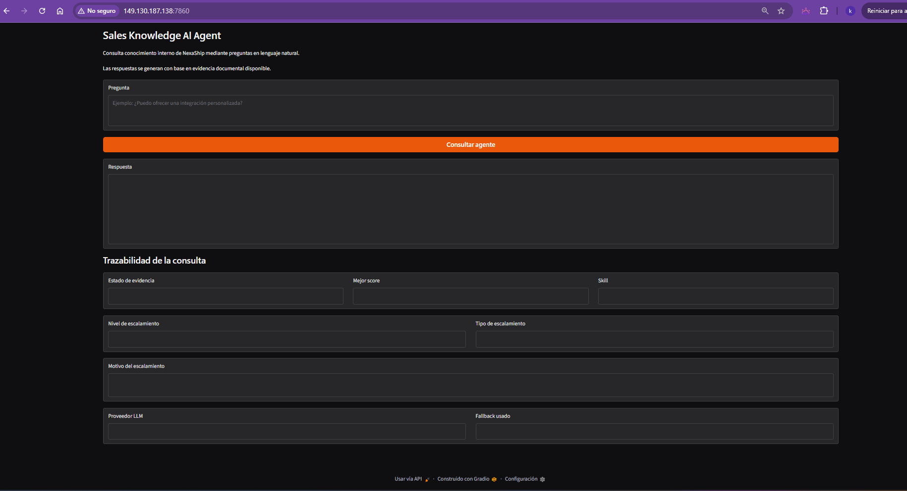
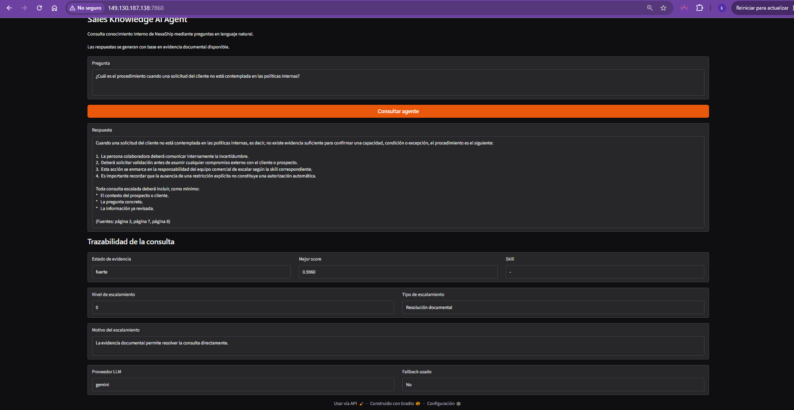

# Sales Knowledge AI Agent — NexaShip

Proyecto desarrollado como solución al Challenge Alura Latam – Agentes de Inteligencia Artificial, aplicando técnicas de Retrieval-Augmented Generation (RAG) para responder consultas sobre conocimiento empresarial.

**Estado del proyecto:** MVP finalizado.

---

## 1. Descripción general del proyecto

**Sales Knowledge AI Agent** es una solución de inteligencia artificial desarrollada para facilitar el acceso al conocimiento interno empresarial de NexaShip mediante preguntas en lenguaje natural.

El agente permite consultar información contenida en documentación interna y generar respuestas sustentadas en evidencia recuperada desde las fuentes disponibles.

A diferencia de un chatbot generativo tradicional, la solución incorpora mecanismos de control orientados a reducir respuestas sin respaldo documental. Antes de generar una respuesta, el sistema evalúa la evidencia recuperada y determina si existe información suficiente para responder con seguridad.

El agente integra:

- recuperación semántica de información mediante RAG;
- procesamiento de documentos PDF;
- embeddings para búsqueda semántica;
- evaluación de evidencia documental;
- control de alucinaciones;
- clasificación de consultas por skill;
- rutas de escalamiento;
- generación de respuestas con LLM;
- fallback entre proveedores LLM;
- trazabilidad de la consulta;
- interfaz web construida con Gradio.

El objetivo principal es facilitar el acceso al conocimiento interno y reducir el riesgo de generar respuestas basadas en suposiciones o información no documentada.

La aplicación de producción del MVP se ejecuta mediante `app.py`, con el notebook `01_mvp_rag.ipynb` como artefacto de desarrollo y validación del flujo RAG.

---

## 2. Contexto de NexaShip

NexaShip es una empresa ficticia de tecnología logística que ofrece una plataforma digital para centralizar y optimizar la gestión de envíos de negocios, tiendas en línea y empresas con operaciones de alto volumen.

Su solución facilita la gestión de operaciones logísticas y la conexión con diferentes herramientas tecnológicas utilizadas por sus clientes.

A medida que una organización crece, también aumenta el conocimiento relacionado con:

- políticas internas;
- condiciones comerciales;
- integraciones tecnológicas;
- procesos operativos;
- gestión de incidencias;
- protección de información;
- criterios de escalamiento;
- situaciones especiales de clientes.

Parte de este conocimiento puede requerir la intervención de personas con diferentes skills y áreas de especialización.

---

## 3. Problema identificado

Los equipos comerciales pueden necesitar resolver consultas relacionadas con políticas, condiciones comerciales, integraciones, operaciones o situaciones especiales antes de responder a un prospecto o cliente.

Cuando el conocimiento se encuentra distribuido entre diferentes fuentes o depende de especialistas específicos, pueden presentarse problemas como:

- tiempos prolongados de espera;
- consultas enviadas al especialista incorrecto;
- dependencia de la disponibilidad de líderes;
- respuestas basadas en conocimiento informal;
- duplicación de preguntas entre equipos;
- pérdida de contexto durante un escalamiento;
- retrasos en oportunidades comerciales;
- riesgo de responder con información no confirmada.

El proyecto busca reducir estos problemas mediante un agente capaz de recuperar evidencia documental, evaluar su suficiencia y controlar cuándo una consulta puede o no ser respondida.

---

## 4. Solución implementada

Sales Knowledge AI Agent proporciona un punto de consulta inteligente para el conocimiento interno de NexaShip.

El flujo general de la solución es:

1. la persona usuaria formula una pregunta en lenguaje natural;
2. el sistema procesa y normaliza la consulta;
3. se generan representaciones semánticas mediante embeddings;
4. el componente RAG recupera los fragmentos documentales más relevantes;
5. se calcula la similitud semántica de las evidencias recuperadas;
6. se evalúa la cobertura léxica entre la pregunta y la evidencia;
7. la evidencia se clasifica según su nivel de suficiencia;
8. si la evidencia es insuficiente, se bloquea la generación de una respuesta no respaldada;
9. si existe evidencia utilizable, se determina la skill asociada;
10. se evalúa la posible ruta de escalamiento;
11. el LLM genera una respuesta utilizando el contexto documental recuperado;
12. si el proveedor principal falla, se activa el mecanismo de fallback;
13. la interfaz presenta la respuesta y datos de trazabilidad.

Este diseño permite separar la recuperación documental, la validación de evidencia y la generación de lenguaje natural.

---

## 5. Arquitectura de la solución

### 5.1 Arquitectura general

```text
┌──────────────────────────────┐
│        Persona usuaria       │
└──────────────┬───────────────┘
               │
               ▼
┌──────────────────────────────┐
│   Interfaz web (Gradio)      │
└──────────────┬───────────────┘
               │
               ▼
┌──────────────────────────────┐
│ Sales Knowledge AI Agent     │
└──────────────┬───────────────┘
               │
               ▼
┌──────────────────────────────┐
│        Motor RAG             │
│                              │
│ • lectura de PDF             │
│ • extracción de texto        │
│ • división en chunks         │
│ • embeddings                 │
│ • búsqueda semántica         │
└──────────────┬───────────────┘
               │
               ▼
┌──────────────────────────────┐
│ Clasificador de evidencia    │
│                              │
│ • similitud semántica        │
│ • cobertura léxica           │
└──────────────┬───────────────┘
               │
       ┌───────┴────────┐
       │                │
       ▼                ▼
┌─────────────┐  ┌─────────────────┐
│ Evidencia   │  │ Evidencia       │
│ utilizable  │  │ insuficiente    │
└──────┬──────┘  └────────┬────────┘
       │                  │
       ▼                  ▼
┌─────────────┐  ┌─────────────────┐
│Clasificador │  │ Prevención de   │
│ por skill   │  │ alucinaciones   │
└──────┬──────┘  └─────────────────┘
       │
       ▼
┌──────────────────────────────┐
│ Clasificador de              │
│ escalamiento                 │
└──────────────┬───────────────┘
               │
               ▼
┌──────────────────────────────┐
│ Generación de respuesta LLM  │
│                              │
│ Proveedor principal:         │
│ Gemini 2.5 Flash             │
│                              │
│ Fallback automático:         │
│ Groq Llama 3.3 70B Versatile │
└──────────────┬───────────────┘
               │
               ▼
┌──────────────────────────────┐
│ Respuesta y trazabilidad     │
│ en interfaz Gradio           │
└──────────────────────────────┘
```

### 5.2 Flujo simplificado

```text
Usuario
    │
Gradio
    │
Clasificador
    │
Embeddings (Sentence Transformers)
    │
Búsqueda semántica
    │
Gemini 2.5 Flash
    │
Fallback Groq (Llama 3.3 70B)
    │
Respuesta
```

### 5.3 Componentes principales

#### Procesamiento documental

El sistema lee el documento PDF utilizado como fuente de conocimiento, extrae su texto y prepara el contenido para la recuperación semántica.

#### Segmentación de contenido

El texto documental se divide en fragmentos manejables mediante `RecursiveCharacterTextSplitter` para mejorar la recuperación de información relevante.

#### Embeddings

Los fragmentos y las preguntas se convierten en representaciones vectoriales mediante Sentence Transformers.

#### Recuperación semántica

El sistema compara la representación de la pregunta con los fragmentos documentales mediante similitud coseno y recupera las evidencias más relevantes.

#### Clasificación de evidencia

La solución combina señales como:

- similitud semántica;
- cobertura léxica.

La evidencia puede clasificarse en estados como:

- `fuerte`;
- `incierta`;
- `insuficiente`.

#### Control de alucinaciones

Cuando la evidencia se clasifica como insuficiente, el agente evita generar información no respaldada.

Este mecanismo busca reducir falsos positivos producidos por similitud semántica superficial.

#### Clasificación por skills

Las consultas pueden asociarse con diferentes áreas o especialidades según el contenido de la pregunta.

#### Escalamiento

El sistema evalúa rutas de escalamiento según la naturaleza de la consulta y el estado de la evidencia.

#### Generación LLM

Cuando existe evidencia utilizable, el sistema construye una respuesta utilizando únicamente el contexto documental recuperado.

#### Fallback entre proveedores

La solución utiliza Google Gemini como proveedor principal y Groq como proveedor alternativo en caso de fallo durante la generación.

#### Interfaz Gradio

La aplicación dispone de una interfaz web para realizar consultas y visualizar información de trazabilidad.

---

## 6. Control de alucinaciones

Uno de los objetivos principales del proyecto es evitar respuestas construidas a partir de información no documentada.

El agente no depende únicamente del score de similitud semántica.

Durante las pruebas se identificó que una consulta fuera del alcance documental podía obtener un score semántico relativamente alto debido a términos ambiguos presentes en el documento.

Por ejemplo:

> ¿NexaShip ofrece seguro médico privado a sus empleados y qué porcentaje de la prima cubre la empresa?

Aunque la consulta podía recuperar fragmentos con similitud semántica por términos como “cobertura”, la documentación no contenía información sobre beneficios médicos para empleados.

Para controlar este comportamiento, la clasificación de evidencia incorpora una validación adicional mediante cobertura léxica.

Como resultado, una similitud semántica alta no es suficiente por sí sola para autorizar la generación de una respuesta.

Cuando la evidencia es insuficiente:

- el agente no inventa información;
- no invoca innecesariamente al proveedor LLM;
- no activa el fallback;
- devuelve una respuesta segura indicando la ausencia de evidencia documental suficiente.

---

## 7. Clasificación por skills

El agente incorpora un mecanismo de clasificación de consultas según la especialidad relacionada con la pregunta.

Entre las categorías contempladas por la solución se encuentran consultas asociadas con temas como:

- integraciones;
- operaciones;
- condiciones comerciales;
- facturación;
- protección de datos;
- clientes enterprise;
- otras especialidades definidas en la lógica del agente.

La clasificación permite enriquecer la trazabilidad de la consulta y apoyar posibles rutas de escalamiento.

---

## 8. Rutas de escalamiento

El agente incorpora lógica para determinar diferentes niveles y tipos de escalamiento.

Según la naturaleza de la consulta, el estado de la evidencia y los términos identificados, una solicitud puede orientarse hacia rutas como:

- resolución documental;
- validación especializada;
- aprobación por liderazgo;
- revisión multidisciplinaria;
- consulta sin ruta determinada cuando no existe evidencia suficiente.

La interfaz presenta información relacionada con:

- estado de evidencia;
- mejor score recuperado;
- skill;
- nivel de escalamiento;
- tipo de escalamiento;
- proveedor LLM;
- uso de fallback.

---

## 9. Tecnologías utilizadas


| Categoría                 | Tecnología               |
| ------------------------- | ------------------------ |
| Lenguaje                  | Python                   |
| Interfaz web              | Gradio                   |
| Proveedor LLM principal   | Google Gemini API        |
| Proveedor LLM de respaldo | Groq API                 |
| Embeddings                | Sentence Transformers    |
| Segmentación de texto     | LangChain Text Splitters |
| Cálculo vectorial         | NumPy                    |
| Procesamiento PDF         | PyPDF                    |
| Variables de entorno      | python-dotenv            |
| Control de versiones      | Git / GitHub             |


---

## 10. Modelos de IA utilizados

### Google Gemini


| Modelo             | Uso                                               |
| ------------------ | ------------------------------------------------- |
| `gemini-2.5-flash` | Proveedor principal para generación de respuestas |


### Groq


| Modelo                    | Uso                                                               |
| ------------------------- | ----------------------------------------------------------------- |
| `llama-3.3-70b-versatile` | Proveedor de fallback automático cuando Gemini no está disponible |


### Embeddings


| Modelo                                                        | Uso                                                                |
| ------------------------------------------------------------- | ------------------------------------------------------------------ |
| `sentence-transformers/paraphrase-multilingual-MiniLM-L12-v2` | Generación de representaciones vectoriales para búsqueda semántica |


---

## 11. Fuente documental

La fuente de conocimiento utilizada por el MVP se encuentra en:

```text
data/documents/Politicas_Internas_NexaShip.pdf
```

El documento contiene lineamientos internos relacionados con:

- gestión comercial;
- confirmación de capacidades y servicios;
- condiciones especiales;
- protección y manejo de datos;
- escalamiento interno;
- clasificación de consultas;
- responsabilidades y restricciones.

La solución procesa este documento y utiliza su contenido como evidencia para responder consultas.

---

## 12. Estructura del repositorio

```text
sales-knowledge-ai-agent/
│
├── app.py
├── requirements.txt
├── README.md
├── .gitignore
├── data/
│   └── documents/
│       └── Politicas_Internas_NexaShip.pdf
└── notebooks/
    └── 01_mvp_rag.ipynb
```

### Archivos principales

#### `app.py`

Aplicación principal del MVP. Contiene el agente RAG completo, los clasificadores de evidencia, skill y escalamiento, la lógica de fallback entre proveedores LLM y la interfaz Gradio.

#### `requirements.txt`

Dependencias del proyecto necesarias para la ejecución local.

#### `01_mvp_rag.ipynb`

Notebook de desarrollo y validación. Contiene el flujo original del MVP, incluyendo pruebas funcionales, evaluación del clasificador y validación adversarial.

#### `Politicas_Internas_NexaShip.pdf`

Fuente documental utilizada como base de conocimiento del MVP.

---

## 13. Instalación

### 13.1 Clonar el repositorio

```bash
git clone https://github.com/kimberlyn05/sales-knowledge-ai-agent.git
cd sales-knowledge-ai-agent
```

### 13.2 Crear entorno virtual (recomendado)

```bash
python -m venv venv
```

**Windows:**

```bash
venv\Scripts\activate
```

**Linux / macOS:**

```bash
source venv/bin/activate
```

### 13.3 Instalar dependencias

```bash
pip install -r requirements.txt
```

Las dependencias principales son:

```text
pypdf
langchain-text-splitters
sentence-transformers
google-genai
groq
gradio
numpy
python-dotenv
```

---

## 14. Configuración del archivo `.env`

El proyecto utiliza un archivo `.env` en la raíz del repositorio para gestionar las credenciales de los proveedores LLM.

Crear el archivo `.env` con el siguiente contenido:

```env
GEMINI_API_KEY=
GROQ_API_KEY=
```


| Variable         | Descripción                                         |
| ---------------- | --------------------------------------------------- |
| `GEMINI_API_KEY` | Clave de API de Google Gemini (proveedor principal) |
| `GROQ_API_KEY`   | Clave de API de Groq (proveedor de fallback)        |


> Las API keys no deben almacenarse directamente en el código ni subirse al repositorio. El archivo `.env` está excluido del control de versiones mediante `.gitignore`.

---

## 15. Ejecución

Una vez instaladas las dependencias y configurado el archivo `.env`, iniciar la aplicación con:

```bash
python app.py
```

La interfaz Gradio se ejecutará en:

```text
http://localhost:7860
```

En entornos de despliegue, la aplicación escucha en `0.0.0.0:7860` para permitir acceso externo a la máquina virtual.

### Ejecución alternativa mediante notebook

También es posible ejecutar el flujo completo desde el notebook de desarrollo:

```text
notebooks/01_mvp_rag.ipynb
```

Esta vía es útil para reproducir pruebas, evaluaciones y el desarrollo iterativo del agente.

---

## 16. Ejemplos de preguntas y respuestas

A continuación se presentan algunos ejemplos de consultas realizadas al agente y las respuestas generadas a partir de la evidencia documental.

### Ejemplo 1

```text
¿Qué tipos de datos personales recopila NexaShip y con qué finalidad?

**Respuesta**

Según la evidencia documental, NexaShip recopila "información de prospectos y clientes" (Página 6).

La finalidad de esta recopilación es para "la finalidad comercial u operativa correspondiente" (Página 6), y para gestionar "oportunidades comerciales, solicitudes de prospectos y clientes, negociaciones" (Página 3).

La evidencia proporcionada no detalla los tipos específicos de datos personales que se incluyen dentro de la categoría de "información de prospectos y clientes".
```

###  Ejemplo 2

```text
¿Cuál es la política de trabajo remoto en NexaShip?

**Respuesta**

La evidencia documental proporcionada no contiene información sobre la política de trabajo remoto en NexaShip. El documento se centra en políticas internas relacionadas con la gestión comercial, negociación, tratamiento de información y escalamiento de consultas.

Fuente: páginas 2, 3, 4, 6.
```

---

## 17. Pruebas y evaluación

La solución incorpora diferentes niveles de validación.

### 17.1 Pruebas de integración del escalamiento

Se evalúa el comportamiento integral del agente ante consultas que requieren diferentes rutas de resolución.

Los escenarios incluyen:

- resolución documental;
- validación especializada;
- aprobación especial;
- revisión multidisciplinaria;
- consultas sin evidencia suficiente.

### 17.2 Evaluación del clasificador de evidencia

El proyecto utiliza casos controlados con preguntas que:

- sí poseen respaldo documental;
- no poseen respaldo documental.

Esto permite evaluar si el clasificador distingue correctamente entre evidencia utilizable e insuficiente.

### 17.3 Validación adversarial

Se incorporó un caso adversarial diseñado para detectar un falso positivo semántico.

La consulta utilizada fue:

```text
¿NexaShip ofrece seguro médico privado a sus empleados y qué porcentaje de la prima cubre la empresa?
```

Este escenario permite comprobar que un score semántico relativamente alto no autorice automáticamente una respuesta cuando la evidencia real no cubre la consulta.

### 17.4 Evaluación final

La evaluación consolidada incluye:

- casos de evaluación;
- casos de validación;
- caso adversarial de regresión.

Durante el desarrollo del MVP se ejecutó un conjunto controlado de pruebas funcionales y adversariales para validar el comportamiento esperado del agente. Este proceso de validación puede ampliarse con nuevos casos de prueba conforme evolucione el proyecto, sin depender de métricas absolutas que puedan quedar desactualizadas.

---

## 18. Interfaz de usuario

La solución incorpora una interfaz desarrollada con Gradio.

La interfaz permite:

- ingresar preguntas en lenguaje natural;
- consultar el agente;
- visualizar la respuesta generada;
- consultar el estado de evidencia;
- visualizar el mejor score recuperado;
- identificar la skill asociada;
- consultar el nivel de escalamiento;
- visualizar el tipo de escalamiento;
- identificar el proveedor LLM utilizado;
- verificar si se utilizó fallback.

Esta trazabilidad permite observar no solo la respuesta final, sino también información relevante sobre la decisión tomada por el agente.

---

## 19. Despliegue en Oracle Cloud Infrastructure (OCI)

La aplicación fue desplegada en una máquina virtual Ubuntu 24.04 dentro de Oracle Cloud Infrastructure.

URL pública de la aplicación:

http://149.130.187.138:7860


### Evidencia del despliegue



## Ejemplo de consulta



---

## 20. Limitaciones actuales

El MVP presenta algunas limitaciones propias del alcance inicial:

- utiliza una fuente documental principal en PDF;
- la clasificación por skills utiliza reglas definidas para el escenario del proyecto;
- las rutas de escalamiento están adaptadas al dominio simulado de NexaShip;
- la evaluación actual utiliza un conjunto controlado de casos;
- la calidad de recuperación depende del contenido y estructura de la documentación;
- el comportamiento puede ampliarse mediante nuevas fuentes y conjuntos de evaluación.

---

## 21. Evolución futura

Entre las posibles mejoras se encuentran:

- incorporación de múltiples documentos;
- procesamiento de archivos CSV;
- ampliación del conjunto de pruebas;
- nuevas fuentes documentales;
- mejoras en la clasificación por skills;
- nuevas pruebas adversariales;
- integración con fuentes empresariales adicionales;

---

## 22. Nota sobre el escenario

NexaShip y la documentación incluida en este repositorio corresponden a un escenario empresarial simulado con fines educativos y demostrativos.

Las políticas, procesos, roles y reglas utilizadas en el proyecto fueron diseñadas específicamente para el desarrollo del Challenge y no representan información interna de una empresa real.

---

## 23. Licencia

Este proyecto se distribuye bajo la licencia MIT.